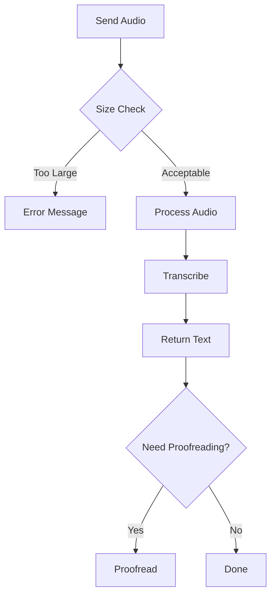
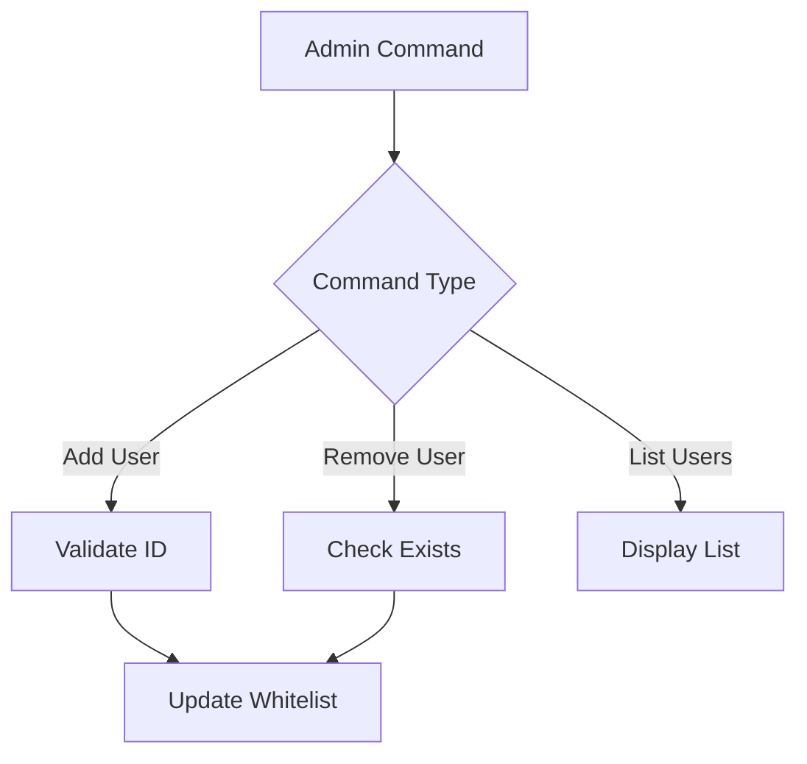

# Product Context

## User Experience

### 1. User Types
- **Admin Users**
  - Full access to all features
  - Whitelist management
  - Debug mode control
  - System monitoring
- **Whitelisted Users**
  - Access to transcription features
  - Language selection
  - Proofreading capabilities
- **Non-whitelisted Users**
  - No access to bot features
  - Receive unauthorized message

### 2. Command Interface
```
Basic Commands:
/start      - Initialize bot and get welcome message
/help       - Display available commands
/language   - Set preferred language
/settings   - View current settings
/transcribe - Transcribe audio message
/proofread  - Improve transcribed text

Admin Commands:
/adduser    - Add user to whitelist
/removeuser - Remove user from whitelist
/listusers  - View whitelisted users
/debug      - Toggle debug mode
```

### 3. Language Support
- English (en-US)
  - Left-to-right text
  - Default language
- Persian/Farsi (fa-IR)
  - Right-to-left text
  - Persian number formatting
- Swedish (sv-SE)
  - Left-to-right text
  - Regional formatting

## Problem Solving

### 1. Audio Transcription
- **Problem**: Users need to convert audio to text
- **Solution**: 
  - Accept voice messages and audio files
  - Support multiple formats
  - Provide accurate transcription
  - Handle multiple languages

### 2. Access Control
- **Problem**: Limit bot access to authorized users
- **Solution**:
  - Whitelist system
  - Admin management
  - Clear access messages
  - Secure user validation

### 3. Text Quality
- **Problem**: Raw transcriptions may need improvement
- **Solution**:
  - Proofreading capability
  - Language-specific formatting
  - Punctuation correction
  - Number formatting

### 4. Debugging
- **Problem**: Need to monitor and troubleshoot
- **Solution**:
  - Comprehensive logging
  - Debug mode toggle
  - Error tracking
  - Performance monitoring

## User Workflows

### 1. Audio Transcription


### 2. Language Selection
```mermaid
graph LR
    A[/language Command] --> B{Valid Language?}
    B -->|Yes| C[Update Preference]
    B -->|No| D[Error Message]
    C --> E[Confirmation]
```

### 3. User Management


## Feature Details

### 1. Audio Processing
- Maximum file size: 20MB
- Supported formats:
  - Voice messages (OGG)
  - Audio files (MP3, WAV)
- Processing steps:
  1. Download file
  2. Convert format
  3. Optimize quality
  4. Transcribe
  5. Clean up

### 2. Text Processing
- Language detection
- RTL/LTR handling
- Number formatting
- Punctuation correction
- Proofreading options

### 3. User Management
- Whitelist storage
- User preferences
- Language settings
- Access control
- Admin privileges

### 4. System Monitoring
- Activity logging
- Error tracking
- Performance metrics
- Debug information
- Security events
