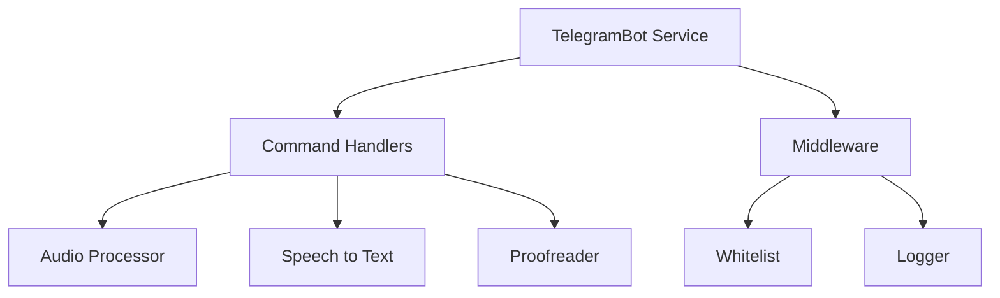
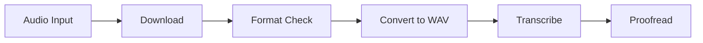
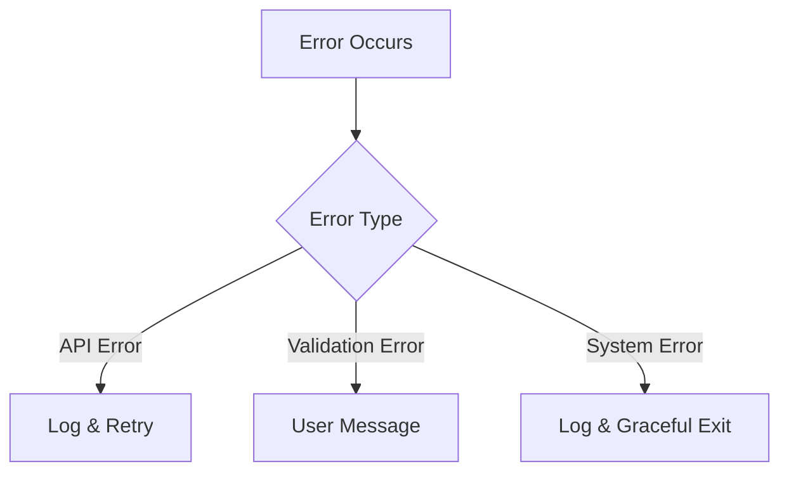
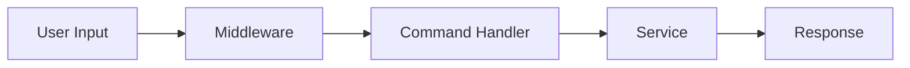
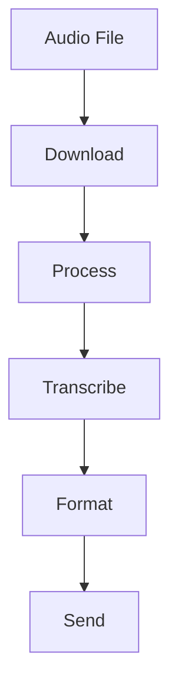

# System Patterns

## Architectural Patterns

### 1. Singleton Pattern
- Used for core services (TelegramBot, Logger, SpeechToText)
- Ensures single instance throughout application
- Manages shared resources and state

### 2. Middleware Pattern
- Whitelist validation
- Request logging
- Error handling
- Command processing

### 3. Service Pattern
- Separate services for different functionalities
- Clear separation of concerns
- Modular and maintainable code

## Design Patterns

### 1. Factory Pattern
- Message creation
- Audio processing configuration
- Logger initialization

### 2. Observer Pattern
- Event handling for bot commands
- Audio processing events
- Logging events

### 3. Strategy Pattern
- Language handling
- Audio format processing
- Proofreading strategies

## Component Relationships

### Bot Service


### Audio Processing


## Code Organization

### 1. Module Structure
- ES Modules for better encapsulation
- Clear import/export patterns
- Modular file organization

### 2. Configuration Management
- Environment-based configuration
- Centralized config object
- Type-safe configuration access

### 3. Error Handling


## Data Flow

### 1. Command Processing


### 2. Audio Processing


## Security Patterns

### 1. Access Control
- Whitelist-based access
- Admin privileges
- Command restrictions

### 2. Data Protection
- Sensitive data redaction
- Temporary file management
- Secure configuration

### 3. Error Prevention
- Input validation
- Type checking
- Resource cleanup

## Logging Patterns

### 1. Log Levels
- DEBUG: Detailed debugging
- INFO: General information
- WARN: Warning conditions
- ERROR: Error conditions

### 2. Log Categories
- User interactions
- System operations
- Security events
- Performance metrics

### 3. Log Format
```json
{
  "timestamp": "ISO-8601",
  "level": "LOG_LEVEL",
  "category": "CATEGORY",
  "message": "MESSAGE",
  "data": {
    "userId": "ID",
    "action": "ACTION",
    "result": "RESULT"
  }
}
